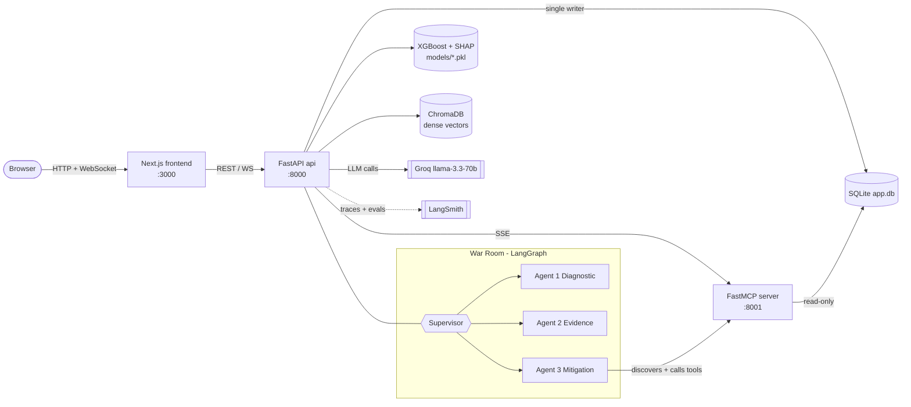
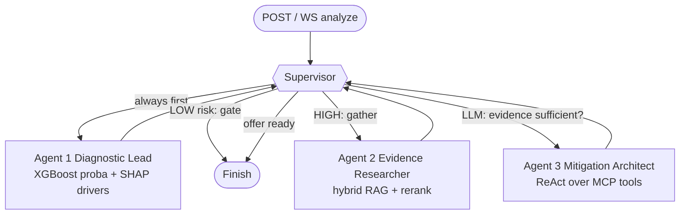
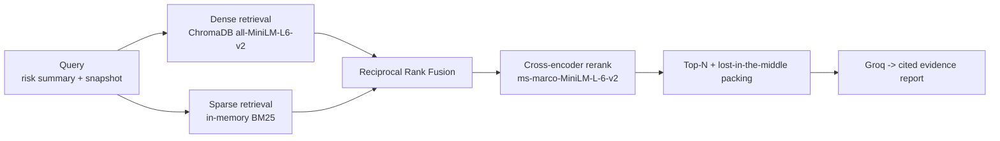
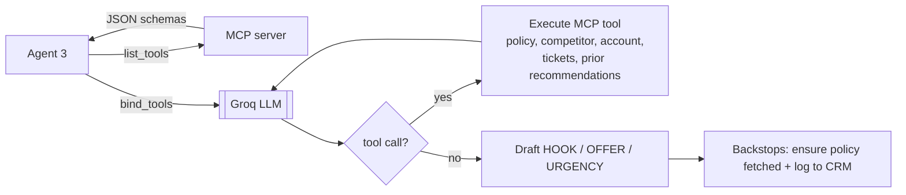

# Churn Intelligence — Multi-Agent Retention Platform

An **enterprise-style AI platform** that turns a telecom churn model into an analyst tool: it scores a customer with **XGBoost + SHAP**, then runs a **LangGraph multi-agent "war room"** — diagnose → gather evidence (hybrid RAG) → draft a policy-safe retention offer (a ReAct agent that discovers and calls **MCP tools**) — streaming every agent's reasoning **token-by-token over WebSockets**. Every run is **traced (LangSmith)** and **guard-railed**.

> Groq-only LLMs · SQLite (raw SQL) · ChromaDB + BM25 + cross-encoder rerank · single enriched MCP server · FastAPI · Next.js · Docker Compose · GitHub Actions → GHCR.

[](https://github.com/yuvaksc/churn-intelligence/actions/workflows/ci.yml)

---

## Highlights

- **Dynamic multi-agent orchestration** — a LangGraph **supervisor** routes between specialists at runtime (not a hardcoded chain); low-risk customers are risk-gated out, the one genuine decision (evidence sufficiency) is made by an LLM, bounded so it can't loop.
- **Agentic tool use over MCP** — Agent 3 is a **ReAct loop**: it *discovers* the MCP server's tools via `list_tools()`, binds them to the LLM, and the model decides which to call (retention policy, competitor intel, account history, open tickets, prior recommendations) before drafting an offer.
- **Expert RAG** — hybrid retrieval (**dense ChromaDB + in-memory BM25 → Reciprocal Rank Fusion → cross-encoder rerank**) with lost-in-the-middle context packing and a cite-or-refuse prompt.
- **Token-level streaming** — a WebSocket endpoint drives `astream_events` and pushes `agent_start` / `token` / `agent_complete` frames; the Next.js UI renders each agent's text live.
- **Observability & safety** — **LangSmith** tracing where every run is recorded live as a `churn-eval` experiment scored by three metrics (output-completeness + an LLM-judge + guardrails), plus backend **guardrails** (PII masking, hard policy-ceiling checks, grounding, prompt-injection heuristics).
- **Production hygiene** — raw-SQL SQLite persistence, a 3-service Docker Compose stack, a `pytest` suite, and CI (ruff + pytest + image builds to **GHCR**).

---

## Architecture



Three containers: **`frontend`** (Next.js), **`api`** (FastAPI + LangGraph + ML/RAG), **`mcp-server`** (FastMCP). The `api` is the **single writer** to SQLite; the MCP server reads it for its data-backed CRM tools.

---

## The War Room (multi-agent flow)

The supervisor is the graph hub — it runs first and regains control after every specialist. Routing is deterministic where the pipeline is linear and LLM-driven at the one real decision point.



| Agent | Does | Tech |
|---|---|---|
| **1 · Diagnostic** | risk score + top SHAP drivers + a short LLM summary | XGBoost, SHAP, Groq |
| **2 · Evidence** | retrieves similar historical churners with their documented reasons, writes a cited evidence report | Hybrid RAG (below) |
| **3 · Mitigation** | dynamically calls MCP tools, drafts a within-policy offer, logs it | ReAct + MCP + Groq |
| **Supervisor** | risk-gate + LLM routing (bounded, no loops) | LangGraph + Groq |

---

## RAG pipeline (Agent 2)



One hybrid search over the `churn_profiles` collection, where each churner carries its **own documented churn reason** as metadata — read straight from the raw CSV by row index, **train split only** (the reason is dropped from the model's features to avoid target leakage, then re-attached to the RAG profile). Agent 2 retrieves similar past churners and frequency-ranks *their* reasons, so the evidence is provably from the customers shown. `query_similar_profiles` returns each result with `rerank_score` / `bm25_score`; BM25 is hand-rolled (no extra dependency) and the cross-encoder reuses `sentence-transformers`.

---

## MCP + ReAct (Agent 3)



The MCP server exposes retention-policy, competitor-intel and **data-backed CRM tools** (backed by SQLite: account history, open tickets, prior recommendations = "memory"). The LLM decides which to call; reliability backstops guarantee the policy fetch and the CRM log.

---

## Observability & Safety

- **LangSmith** — set `LANGSMITH_TRACING=true` and each war-room run is traced **as an experiment run on the `churn-eval` dataset** (visible under Datasets & Experiments): the actual execution *is* the experiment run, so it carries the full agent1/2/3 waterfall, per-node latency and token usage, linked to the golden of its risk label. Three feedback metrics are attached: `output_completeness` (did the run produce all the JSON elements the reference archetype has for its risk label), `warroom_quality` (a holistic **Groq LLM-judge** — an overall score plus the reasoning behind it), and `guardrails` (did the offer's PII / policy-ceiling / grounding checks all pass). The three golden customers are per-label **archetypes** of the expected output, not a per-customer answer key.
- **Guardrails** — PII masking, a hard policy-ceiling check on the drafted discount, a grounding/citation check, and a prompt-injection heuristic; results ride along on the response.

---

## Quickstart

**Prerequisites:** Docker Desktop, a [Groq API key](https://console.groq.com), and the [IBM Telco Customer Churn](https://www.kaggle.com/datasets/blastchar/telco-customer-churn) CSV at `data/raw/telco.csv`.

```bash
# 1. Train the model (XGBoost + SHAP -> models/)
python run_pipeline.py

# 2. Configure secrets (KEY=VALUE lines only -- no comments; compose is strict)
cat > .env <<'EOF'
GROQ_API_KEY=your_groq_key
LANGSMITH_TRACING=true
LANGSMITH_ENDPOINT=https://api.smith.langchain.com
LANGSMITH_API_KEY=your_langsmith_key
LANGSMITH_PROJECT=churn
EOF

# 3. Launch the stack (the api seeds SQLite from the model on first boot)
docker compose up -d --build

# 4. Build the vector index INSIDE the container, so the ChromaDB that writes the
#    store is the exact one that serves it. Building it elsewhere (e.g. locally)
#    can leave a store the container can't open ("could not connect to tenant").
docker compose exec api python rag/build_index.py

# 5. Open the dashboard
#    http://localhost:3000        (UI)
#    http://localhost:8000/docs   (OpenAPI)
```

Pick a **HIGH-risk** customer → **Run Analysis** → watch each agent stream its reasoning live.
Each run appears as an experiment on the `churn-eval` dataset — full waterfall + `output_completeness` / `warroom_quality` / `guardrails` metrics.

---

## Configuration

| Variable | Required | Purpose |
|---|---|---|
| `GROQ_API_KEY` | yes | Groq LLM (all agents, supervisor, judge) |
| `LANGSMITH_TRACING` / `_ENDPOINT` / `_API_KEY` / `_PROJECT` | no | tracing + eval (off when unset) |
| `APP_DB_PATH` | no | SQLite path (default `data/app.db`) |
| `MCP_TRANSPORT` / `MCP_SERVER_URL` / `MCP_HOST` / `MCP_PORT` | (compose) | MCP transport (`sse` in Docker, `stdio` locally) |
| `NEXT_PUBLIC_API_BASE` | (build arg) | frontend -> api base URL |

---

## API reference

| Method | Path | Description |
|---|---|---|
| `GET` | `/health` | model + test-set + Chroma status |
| `GET` | `/api/customers` | risk-sorted list (`limit`, `offset`, `risk_only`) |
| `GET` | `/api/customers/{id}` | full features + top SHAP drivers |
| `WS` | `/api/analyze/{id}/ws` | **WebSocket** stream — runs the war room, streams tokens |
| `GET` | `/api/logs` | retention/CRM action log |
| `GET` | `/api/metrics` | model metrics + ROI |

The war room runs over a single **WebSocket** endpoint (token-level streaming). See [`docs/ARCHITECTURE.md`](docs/ARCHITECTURE.md) for the request sequence and DB schema.

---

## Tech stack

**AI/ML:** LangGraph · LangChain · Groq (`llama-3.3-70b-versatile`) · Model Context Protocol (FastMCP) · ChromaDB · sentence-transformers (bi- + cross-encoder) · BM25 · XGBoost · SHAP · LangSmith
**Backend:** FastAPI · WebSockets · SQLite (raw SQL, `sqlite3` + `asyncio.to_thread`)
**Frontend:** Next.js 16 · React 19 · TypeScript · Tailwind
**Infra:** Docker Compose (3 services) · GitHub Actions → GHCR · ruff · pytest

---

## Project structure

```
api/          FastAPI app - routes, schemas, WebSocket streaming, guardrail wiring
agents/       LangGraph war room - supervisor + agent1/2/3, MCP client, ReAct loop
rag/          Hybrid retrieval - bm25, fusion (RRF), rerank (cross-encoder), retriever
mcp_server/   FastMCP server - retention policy, competitor intel, data-backed CRM tools
db/           Raw-SQL SQLite layer - customers, recommendations, crm, meta (+ schema.sql)
guardrails/   PII masking, policy-ceiling, grounding, injection
eval/         Live LangSmith eval - war-room run as a churn-eval experiment (completeness / quality / guardrails)
src/          ML - data loader, XGBoost training, SHAP explainability
frontend/     Next.js dashboard + live-token war-room UI
tests/        pytest suite (api routes, websocket, mcp tools, supervisor, guardrails)
docker/       Dockerfiles (api, mcp, frontend)
.github/      CI - ruff + pytest + GHCR image builds
```

---

## Testing & CI

```bash
pip install -r requirements-test.txt   # light deps only (no ML stack)
pytest          # unit suite: API routes, WebSocket, MCP tools, supervisor routing, guardrails
ruff check .    # critical-error lint gate
```

The unit suite covers the system surfaces without the heavy ML/LLM stack — it stubs the model/graph boundaries and mocks nothing it doesn't own, so it runs in seconds. The full model → RAG → MCP → agent path is integration-tested via Docker.

CI (`.github/workflows/ci.yml`): **lint** (ruff) → **test** (pytest) → **images** (buildx builds all three Dockerfiles and pushes to **GHCR** on push, tagged `latest` + short SHA, with layer caching). PRs run lint + test only.

---

## Screenshots

_Add screenshots of the dashboard and the live-streaming war room to `docs/screenshots/` and embed them here._
