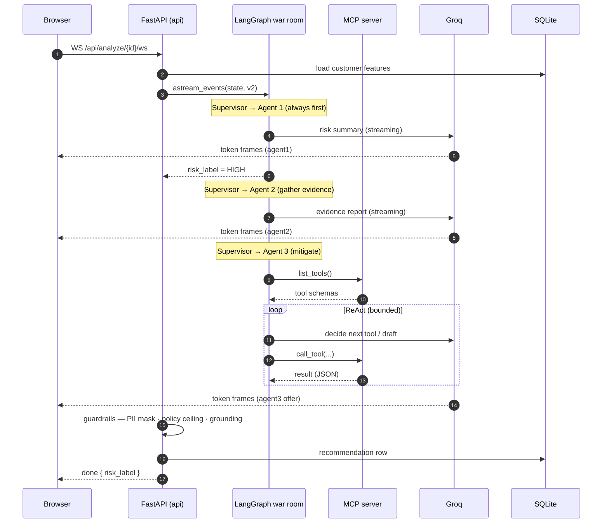
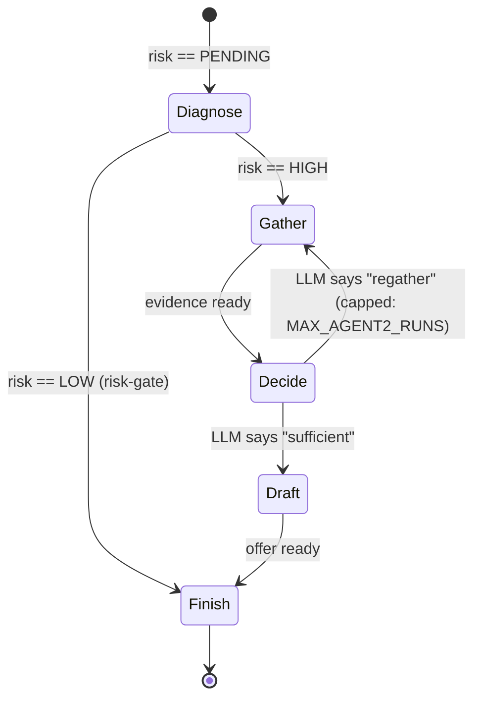
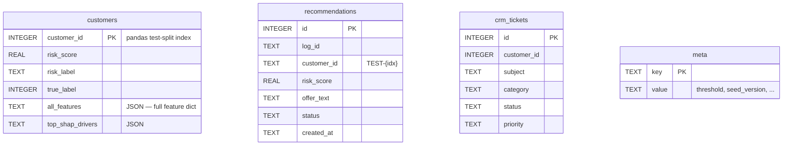
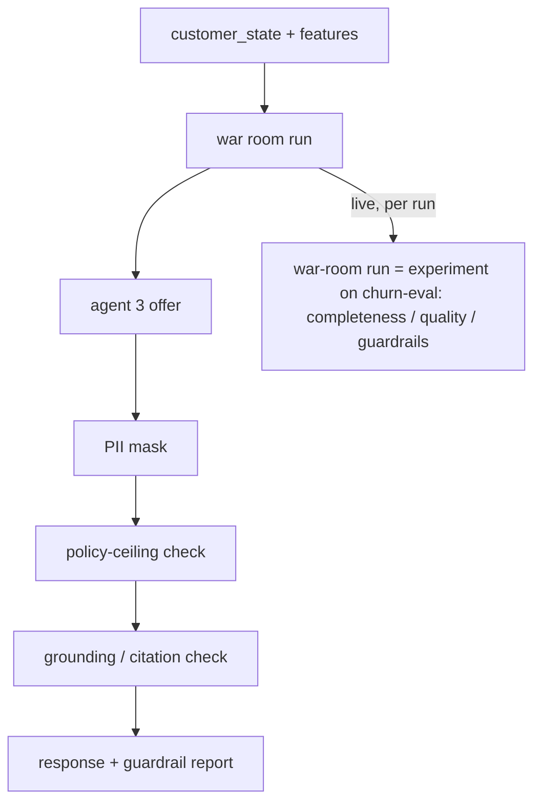

# Architecture

Deep-dive diagrams and design notes. For the overview, see the [README](../README.md).

## Request sequence (WebSocket analysis)

An end-to-end analysis, streamed token-by-token:

Low-risk customers short-circuit: the supervisor routes Agent 1 → **FINISH** and Agents 2/3 never run (the UI marks them *skipped*).

## Supervisor state machine

The supervisor is deterministic where the flow is linear and only asks the LLM at the one genuine decision — is the gathered evidence sufficient to draft, or gather once more?

A hard `MAX_STEPS` cap and the re-gather cap guarantee termination — a lesson learned in verification, where an unconstrained LLM router looped `agent2` five times until the cap.

## Data model

The `api` process is the **single writer**; the MCP server issues read-only `SELECT`s for its data-backed tools. Raw SQL, no ORM (`sqlite3` + `asyncio.to_thread`), schema in `db/schema.sql`.

Tables are linked logically (by `customer_id`) but not FK-constrained — `customers` uses the integer split index, while `recommendations` stores the display id `TEST-{idx}`. `customers` and `crm_tickets` are **seeded** at startup from the model/test-split; `recommendations` accumulate per run.

## Safety & evaluation flow

- **Guardrails** run inline on the drafted offer for every request (both POST and WS paths) and never block hard (this is an internal analyst tool) — violations are flagged on the response.
- **Eval** runs **live** as part of every analysis: the WebSocket attaches `eval.experiment_callbacks(...)` to the war-room run so the actual graph execution is traced *as an experiment run* under the `churn-eval` dataset (its own full waterfall, linked to the same-label golden archetype). After the `done` frame, `eval.score_run(...)` attaches three feedback metrics — `output_completeness` (a deterministic check that the run produced all the JSON elements the archetype has for its risk label), `warroom_quality` (a holistic Groq LLM-judge: overall score + the reasoning behind it), and `guardrails` (did the offer's PII / policy-ceiling / grounding checks all pass; offer runs only). Each analysis is its own experiment (`churn-warroom-<customer>-<time>`), so runs never collapse into repetitions of the shared archetype example. Best-effort — a no-op when tracing is off, and it never delays the UI. The three golden customers are per-label **archetypes** of the expected output (linked by risk label, not matched per customer).

## Streaming internals

The WebSocket endpoint (`api/routes/ws.py`) drives `war_room_graph.astream_events(version="v2")` and translates the event stream into UI frames:

| LangGraph event | → WS frame |
|---|---|
| `on_chat_model_stream` (node ∈ agent1/2/3) | `{type: "token", agent, text}` |
| node `on_chain_end` | `{type: "agent_complete", agent, data}` |
| stream end | `{type: "done", risk_label, input_scan}` |

Only the three narrative agents stream tokens; the supervisor's structured-output routing and Agent 3's tool-deciding calls carry no useful text. The WebSocket is the war room's single entry point — there is no separate POST or SSE path.
